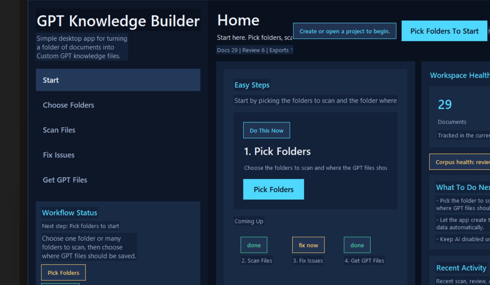
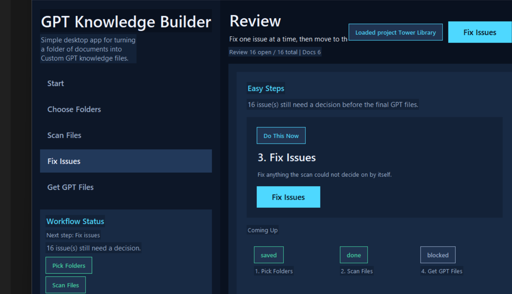
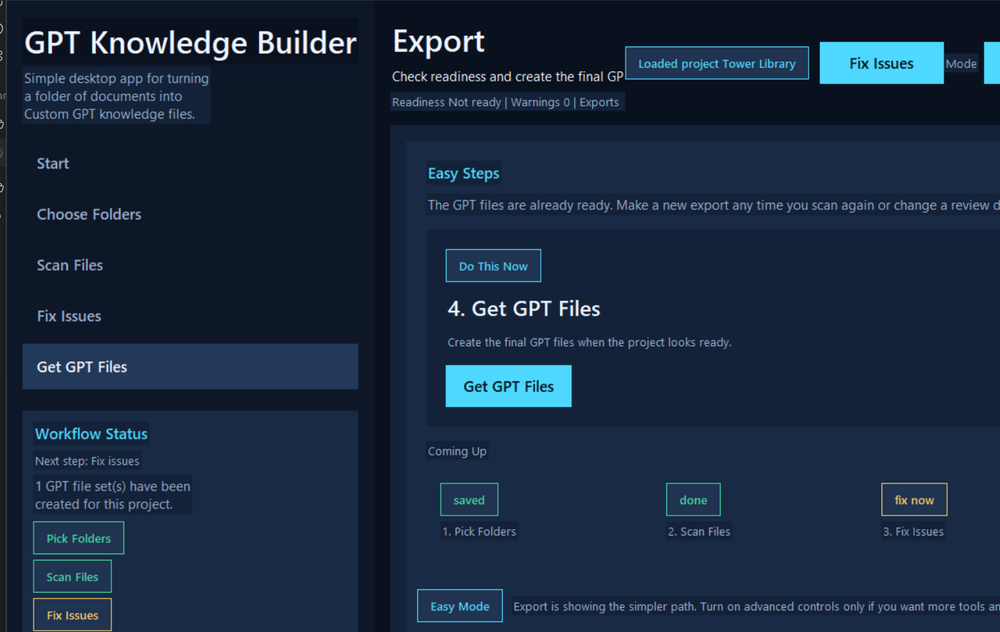

# GPT Knowledge Builder

[](https://github.com/AboveWireless/gpt-knowledge-builder/actions/workflows/ci.yml)
[](https://github.com/AboveWireless/gpt-knowledge-builder/releases)
[](https://github.com/AboveWireless/gpt-knowledge-builder/blob/main/LICENSE)

Local-first desktop app for Windows and macOS that turns messy document folders into clean, upload-ready Custom GPT knowledge packages.


## What it is

GPT Knowledge Builder is a beginner-friendly desktop workspace for turning raw folders into clean GPT knowledge files.

It helps you:

- pick one folder or many folders without hand-building project plumbing
- scan mixed documents into a reviewable workspace
- fix duplicates, weak OCR, extraction issues, and low-signal content one issue at a time
- export a small, traceable GPT-ready package instead of dumping raw files straight into a model

The public product posture is:

- GUI-first for non-technical users
- advanced CLI for power users and automation
- local-first by default
- optional AI enrichment only when explicitly enabled

## Why this exists

Most people building Custom GPTs either upload raw documents directly or spend hours hand-curating files and names. This app turns that into a repeatable desktop workflow:

- ingest mixed business documents from a real folder tree
- normalize and score the corpus
- surface duplicate, weak, OCR, and taxonomy issues for review
- export a small set of upload-ready GPT knowledge files with traceable provenance

## Who it is for

- consultants building Custom GPTs from client document sets
- teams packaging internal SOPs, product docs, policies, and training material
- power users who want repeatable project workspaces and deterministic exports

## Simple workflow

1. `Pick Folders`
2. `Scan Files`
3. `Fix Issues`
4. `Get GPT Files`

That beginner-first flow now ships with larger spacing, plainer wording, and one obvious next action on every screen.

## At a glance


## Download the right version

Each GitHub release includes both desktop versions:

- `Windows version`: download `GPTKnowledgeBuilder-<version>-Setup.exe`, run the installer, then launch `GPT Knowledge Builder` from the Start menu.
- `macOS version`: download `GPTKnowledgeBuilder-<version>-macos.dmg` or `GPTKnowledgeBuilder-<version>-macos.zip`, move `GPT Knowledge Builder.app` into `Applications`, then launch it from Finder or Spotlight.

If macOS shows a security warning the first time you open it, Control-click the app, choose `Open`, and confirm. If macOS still blocks it, open `System Settings` -> `Privacy & Security` and choose `Open Anyway`.

## Screenshots

### Easy Start



### Guided Review



### Clean Export



## Why it works

- Project-based workflow with persistent cache, review queue, and export history
- Clean GPT package output instead of raw text dumps
- Canonical naming and provenance sidecars for traceability
- Optional OpenAI enrichment for title cleanup, taxonomy suggestion, and synthesis support
- installable desktop builds for Windows and macOS with no Python required for end users

## What you get out of it

- `knowledge_core` pages for high-signal GPT grounding
- `reference_facts`, `procedures`, `glossary`, and `entities` artifacts
- `package_index.md` and optional provenance/debug sidecars
- a persistent workspace you can reopen instead of rescanning everything every time

## Quick start for Windows users

Download the latest installer from [GitHub Releases](https://github.com/AboveWireless/gpt-knowledge-builder/releases), install the app, then launch `GPT Knowledge Builder` from the Start menu.

Typical workflow:

1. Create a project.
2. Add one or more source folders.
3. Run `Scan`.
4. Review flagged items.
5. Run `Export` to create the GPT upload package.

The app writes a clean package plus optional provenance/debug outputs under your configured export directory.


## Quick start for macOS users

Download the latest macOS release from [GitHub Releases](https://github.com/AboveWireless/gpt-knowledge-builder/releases), open the `.dmg` or `.zip`, move `GPT Knowledge Builder.app` into `Applications`, then launch it from Finder or Spotlight.

If macOS warns that the app is from an unidentified developer, Control-click the app, choose `Open`, and confirm. If you still do not see the app open, go to `System Settings` -> `Privacy & Security` and press `Open Anyway`.

Typical workflow:

1. Pick one or more source folders.
2. Run `Scan Files`.
3. Fix any flagged issues.
4. Run `Get GPT Files`.

The app writes a clean package plus optional provenance/debug outputs under your configured export directory.

## Feature highlights

| Area | What it does |
| --- | --- |
| Ingestion | Scans PDFs, DOCX, XLSX, CSV, TXT, Markdown, HTML, XML, JSON, and OCR-supported images |
| Review | Flags duplicate, low-signal, OCR, and taxonomy issues before export |
| AI | Optional OpenAI-assisted title cleanup, taxonomy suggestion, and synthesis hints |
| Packaging | Produces a curated GPT upload pack instead of a raw text dump |
| Traceability | Writes provenance sidecars without polluting the upload package |
| Desktop UX | GUI-first workflow with a persistent project workspace |

## Source install for developers

Core install:

```powershell
python -m pip install -e .
```

Recommended local development install:

```powershell
python -m pip install -e ".[dev,extractors,ai]"
```

Optional OCR support:

```powershell
python -m pip install -e ".[ocr]"
```

Launch the GUI:

```powershell
python -m knowledge_builder
```

Or use the installed GUI script:

```powershell
gpt-knowledge-builder
```

## GUI-first workflow

The desktop workspace is organized around guided steps with optional advanced controls:

- `Home`
- `Sources`
- `Processing`
- `Review`
- `Export`
- `Diagnostics`, `History`, and `Settings` when you need the denser tools

Persistent projects store:

```text
<project_dir>/
  project.yaml
  .knowledge_builder/
    cache/
    logs/
    reviews.json
    state.json
    secrets.json
```

Advanced CLI equivalents:

```powershell
python -m knowledge_builder project init --project-dir C:\gptkb\workspace --source-root C:\docs --output-dir C:\gptkb\exports --project-name tower_library
python -m knowledge_builder project scan --project-dir C:\gptkb\workspace
python -m knowledge_builder project review --project-dir C:\gptkb\workspace --approve-all
python -m knowledge_builder project export --project-dir C:\gptkb\workspace --zip-pack
```

## Supported inputs

- PDF
- DOCX
- XLSX
- CSV
- TXT
- Markdown
- HTML
- XML
- JSON
- PNG / JPG / JPEG via OCR when OCR support is installed

## Export output

The final GPT package is intentionally clean:

```text
<output_dir>/<pack_name>_GPT_KNOWLEDGE/
  INSTRUCTIONS.txt
  FILE_GUIDE.txt
  <corpus_name>__knowledge_core__p01.md
  <corpus_name>__knowledge_core__p02.md
  <corpus_name>__reference_facts.md
  <corpus_name>__glossary.md
  <corpus_name>__procedures.md
  <corpus_name>__entities.md
```

Files are omitted when they would be empty or weak, except for `INSTRUCTIONS.txt` and `FILE_GUIDE.txt`.

Project exports can also write provenance sidecars such as:

- `package_index.md`
- `knowledge_items.jsonl`
- `provenance_manifest.json`
- split artifact pages when content grows too large

This separation matters:

- the GPT upload package stays small and readable
- provenance and debug outputs remain available for audit and troubleshooting

## AI enrichment

AI enrichment is optional.

Current enrichment features include:

- title cleanup
- domain/topic suggestion
- synopsis and glossary hints
- cached Responses API outputs keyed by checksum, model, and prompt version

Users can provide their own API key through the app or via `OPENAI_API_KEY`.

Important behavior:

- AI is off by default
- text is only sent to the provider when the user enables enrichment
- project-local API keys are currently stored in `.knowledge_builder/secrets.json`
- Windows Credential Manager support is a planned upgrade, not part of this first public release

## OCR requirements

OCR is optional.

To enable OCR-assisted extraction for image documents and scanned PDFs:

```powershell
python -m pip install -e ".[ocr]"
```

Users also need the external Tesseract OCR runtime installed and available on the system path.

If OCR dependencies are missing, the extractor degrades gracefully and records the missing extractor state instead of crashing.

## Windows packaging

Build prerequisites:

- Python 3.10 or newer
- Inno Setup 6 for installer creation
- optional Tesseract runtime for OCR-enabled testing

Build the Windows app locally:

```powershell
python -m pip install -e ".[windows-build,extractors,ocr,ai]"
powershell -ExecutionPolicy Bypass -File .\scripts\build_windows.ps1
```

Outputs:

```text
dist\
  GPT Knowledge Builder\
    GPTKnowledgeBuilder.exe
  installer\
    GPTKnowledgeBuilder-<version>-Setup.exe
```

See [docs/windows-build.md](docs/windows-build.md) for build details and [docs/release-process.md](docs/release-process.md) for the release checklist.

## macOS packaging

Build prerequisites:

- Python 3.10 or newer
- Xcode Command Line Tools
- optional Tesseract runtime for OCR-enabled testing

Build the macOS app locally on a Mac:

```bash
python -m pip install -e ".[macos-build,extractors,ocr,ai]"
bash ./scripts/build_macos.sh
```

Outputs:

```text
dist/
  GPT Knowledge Builder.app
  GPTKnowledgeBuilder-<version>-macos.zip
  installer/
    GPTKnowledgeBuilder-<version>-macos.dmg
```

See [docs/macos-build.md](docs/macos-build.md) for build details and [docs/release-process.md](docs/release-process.md) for the release checklist.

## Advanced CLI

The advanced project CLI remains supported:

```powershell
python -m knowledge_builder project validate --project-dir C:\gptkb\workspace
python -m knowledge_builder project review --project-dir C:\gptkb\workspace --review-id "<doc>::taxonomy" --status accepted --override-title "Grounding Basics" --override-domain operations --note "Reviewed manually"
```

The original one-shot compiler remains available for compatibility, but it is no longer the primary public workflow:

```powershell
python -m knowledge_builder scan-docs --input-dir C:\docs --output-dir C:\out --pack-name tower_library
scan-docs --input-dir C:\docs --output-dir C:\out --pack-name tower_library
```

## Refresh GitHub screenshots

Use the screenshot helper to regenerate the repo images after a UI refresh:

```powershell
python .\scripts\render_github_screenshot.py --render-repo-assets
```

That command rebuilds demo scenes and refreshes:

- `docs/images/github-home.png`
- `docs/images/github-review.png`
- `docs/images/github-export.png`

## Troubleshooting

- If the GUI does not launch, verify Tk is available in your Python installation.
- If OCR results are empty, verify Tesseract is installed and callable from the command line.
- If AI enrichment is enabled but nothing runs, verify the API key and provider settings.
- If Windows packaging fails, confirm Inno Setup 6 is installed or rerun the build script with `-SkipInstaller`.
- If macOS packaging fails, confirm Xcode Command Line Tools are installed and rerun `bash ./scripts/build_macos.sh`.

## Repository guides

- [Windows build guide](docs/windows-build.md)
- [macOS build guide](docs/macos-build.md)
- [Release process](docs/release-process.md)
- [Privacy and data handling](docs/privacy-and-data-handling.md)

## Project status

This is an installable public-preview release of the product. The core workflow is stable, but security and distribution upgrades are still planned:

- Windows Credential Manager for API keys
- code signing for Windows and macOS releases
- richer knowledge-item review editing

## License

MIT. See [LICENSE](LICENSE).
