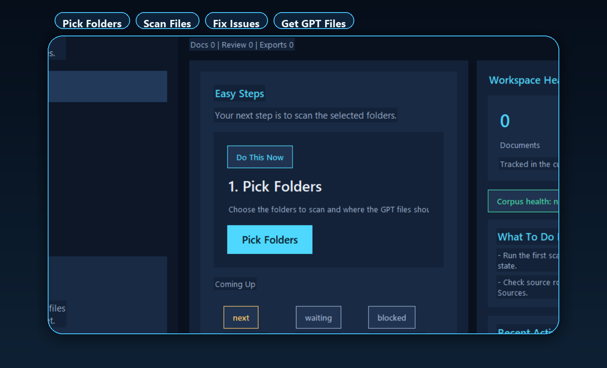
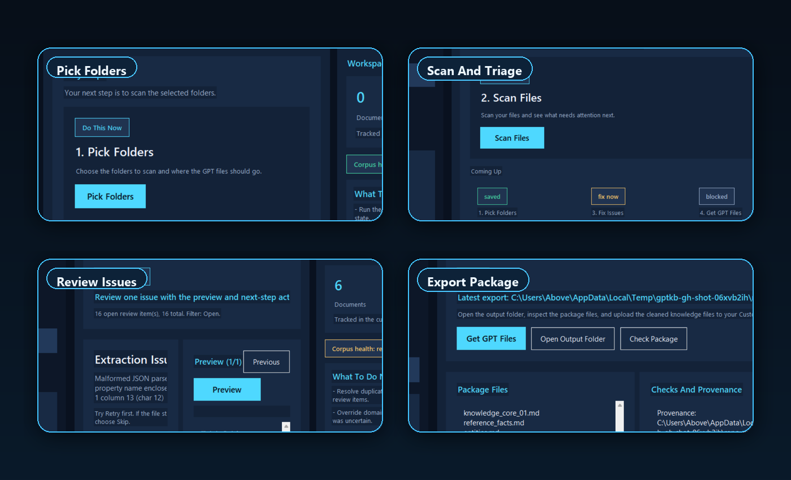
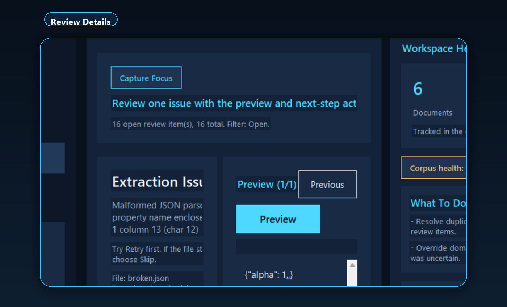
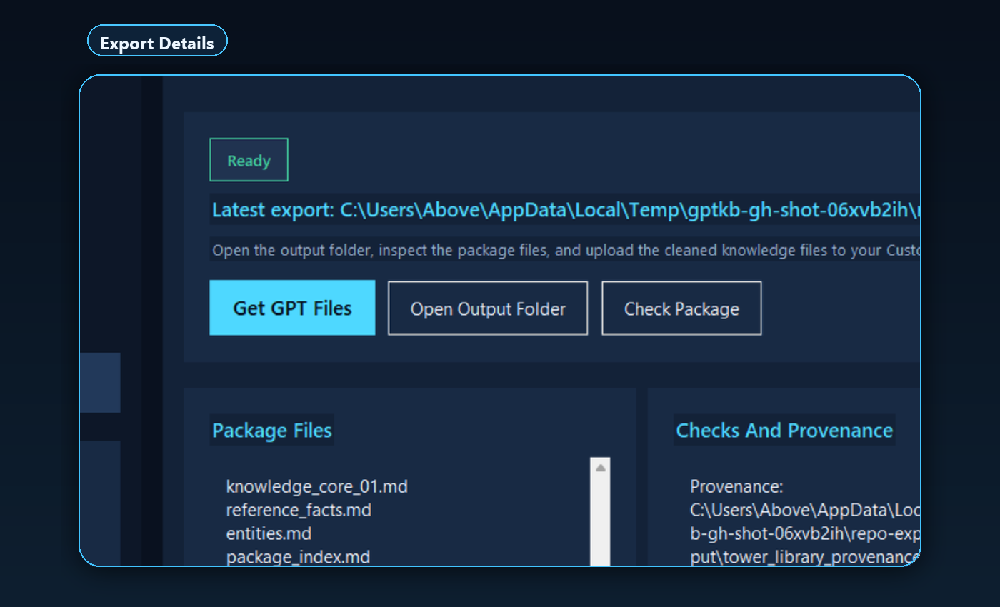

# GPT Knowledge Builder

Local-first desktop app for Windows and macOS that turns messy document folders into clean, upload-ready Custom GPT knowledge packages.

Turn a folder mess into GPT-ready files with a simple four-step desktop flow:

1. `Pick Folders`
2. `Scan Files`
3. `Fix Issues`
4. `Get GPT Files`

## What each step does

- `Pick Folders`: choose one or more source folders, choose where the finished GPT files should go, and let the app keep its internal workspace files out of your way.
- `Scan Files`: build a working snapshot of the corpus, estimate how heavy the scan will be, and surface files that may need OCR, retries, or human review.
- `Fix Issues`: work through the review queue with preview-first actions like `Accept`, `Skip`, `Retry`, and `Next` so weak extractions do not silently slip into the final package.
- `Get GPT Files`: create the final upload-ready package, run `Check Package` if you want one more pass, and open the output folder with the final files and provenance sidecars.

## Why it works

- Beginner-first desktop workflow with one clear next action on every main screen.
- Review queue catches duplicates, low-signal content, weak OCR, and extraction issues before export.
- Final package stays small and traceable instead of dumping raw source folders into a model.
- Optional OpenAI enrichment stays off until the user explicitly enables it.

## Main features

- Guided mode with plain-language labels and one obvious primary action on each screen.
- Saved projects so you can reopen the same workspace instead of rebuilding the corpus from scratch.
- Source preview and dependency health checks that help you estimate scan size and spot missing OCR tooling early.
- Review filters for duplicates, extraction issues, taxonomy uncertainty, low-signal content, and OCR-related problems.
- Export validation, package summaries, and provenance outputs so the delivery is easier to trust and inspect.

## Review and export with confidence

## How to use the app

1. Open the app and click `Pick Folders To Start`, or use `Open Existing Project` if you already have a saved workspace.
2. Add the folders you want scanned and choose the folder where the GPT files should be saved.
3. Click `Scan Files` and let the app build the working corpus.
4. Open `Fix Issues` and review anything the scan could not decide on automatically.
5. Click `Get GPT Files` when the project is ready, then use `Open GPT Files Folder` to inspect the results.
6. Reopen the same project later if you want to rescan, keep reviewing, or export another package.

## Download status

When a tagged GitHub release is published, it will include Windows and macOS desktop packages plus `SHA256SUMS.txt`.

This repo is prepared for the first public-preview desktop release, but the first tagged GitHub release has not been published yet.

- `Windows version`: when a tagged release is published it will include `GPTKnowledgeBuilder-<version>-Setup.exe` and `GPTKnowledgeBuilder-<version>-portable.zip`.
- `macOS version`: when a tagged release is published it will include `GPTKnowledgeBuilder-<version>-macos.dmg` and `GPTKnowledgeBuilder-<version>-macos.zip`.
- `Checksums`: release assets are paired with `SHA256SUMS.txt` so downloads can be verified before launch.
- `No release yet`: If the [Releases](https://github.com/AboveWireless/gpt-knowledge-builder/releases) page is empty, use the Windows or macOS build guides below to create the desktop app locally.
- `macOS first launch`: if Gatekeeper blocks the app, Control-click it, choose `Open`, and use `System Settings` -> `Privacy & Security` -> `Open Anyway` if needed.

## Docs

- [User guide](docs/user-guide.md)
- [Developer setup](docs/developer-setup.md)
- [Product capabilities](docs/product-capabilities.md)
- [Windows build guide](docs/windows-build.md)
- [macOS build guide](docs/macos-build.md)
- [Release process](docs/release-process.md)
- [Privacy and data handling](docs/privacy-and-data-handling.md)

## Project status

- CI is green across Windows, macOS, and Linux.
- The release workflow builds Windows and macOS packages and publishes `SHA256SUMS.txt` on tagged releases.
- Remaining release hardening is mostly around the first public tag, code signing, Windows Credential Manager, and richer review editing.

## License

MIT. See [LICENSE](LICENSE).
