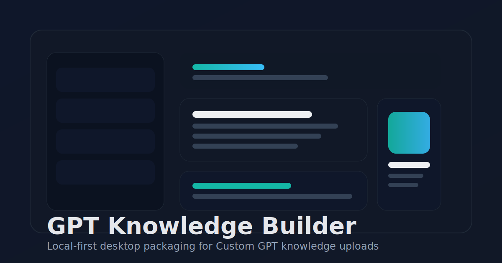
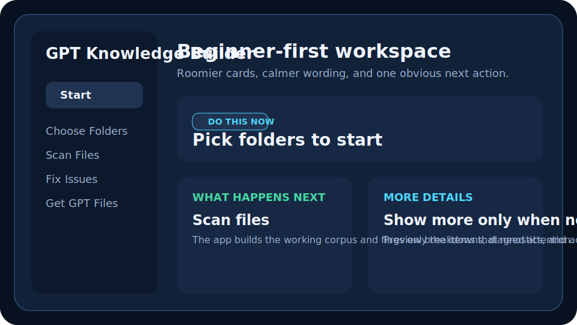
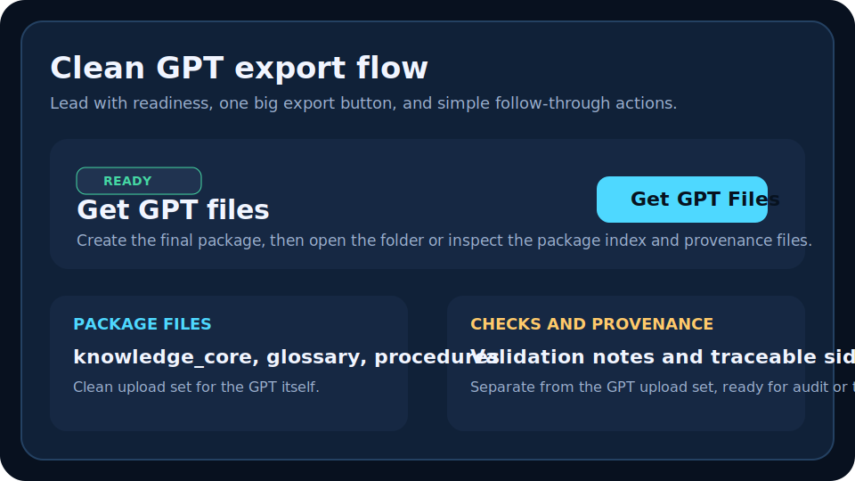

# GPT Knowledge Builder

Local-first Windows desktop app for turning document corpora into upload-ready Custom GPT knowledge packages.



## What it is

GPT Knowledge Builder scans mixed document sources, extracts usable text, helps you review low-confidence or duplicate material, and exports a clean package of GPT-ready knowledge files plus optional provenance sidecars.

The public product posture is:

- GUI-first for non-technical users
- advanced CLI for power users and automation
- local-first by default
- optional AI enrichment only when explicitly enabled

## Who it is for

- consultants building Custom GPTs from client document sets
- teams packaging internal SOPs, product docs, policies, and training material
- power users who want repeatable project workspaces and deterministic exports

## Product views

### Workspace



### Export package



## Core value

- Project-based workflow with persistent cache, review queue, and export history
- Clean GPT package output instead of raw text dumps
- Canonical naming and provenance sidecars for traceability
- Optional OpenAI enrichment for title cleanup, taxonomy suggestion, and synthesis support
- Windows-installable desktop build with no Python required for end users

## Quick start for Windows users

Download the latest installer from GitHub Releases, install the app, then launch `GPT Knowledge Builder` from the Start menu.

Typical workflow:

1. Create a project.
2. Add one or more source folders.
3. Run `Scan`.
4. Review flagged items.
5. Run `Export` to create the GPT upload package.

The app writes a clean package plus optional provenance/debug outputs under your configured export directory.

## Source install for developers

Core install:

```powershell
python -m pip install -e .
```

Recommended local development install:

```powershell
python -m pip install -e ".[dev,extractors,ai]"
```

Optional OCR support:

```powershell
python -m pip install -e ".[ocr]"
```

Launch the GUI:

```powershell
python -m knowledge_builder
```

Or use the installed GUI script:

```powershell
gpt-knowledge-builder
```

## GUI-first workflow

The desktop workspace is organized around six views:

- `Home`
- `Sources`
- `Processing`
- `Review`
- `Export`
- `Settings`

Persistent projects store:

```text
<project_dir>/
  project.yaml
  .knowledge_builder/
    cache/
    logs/
    reviews.json
    state.json
    secrets.json
```

Advanced CLI equivalents:

```powershell
python -m knowledge_builder project init --project-dir C:\gptkb\workspace --source-root C:\docs --output-dir C:\gptkb\exports --project-name tower_library
python -m knowledge_builder project scan --project-dir C:\gptkb\workspace
python -m knowledge_builder project review --project-dir C:\gptkb\workspace --approve-all
python -m knowledge_builder project export --project-dir C:\gptkb\workspace --zip-pack
```

## Supported inputs

- PDF
- DOCX
- XLSX
- CSV
- TXT
- Markdown
- HTML
- XML
- JSON
- PNG / JPG / JPEG via OCR when OCR support is installed

## Export output

The final GPT package is intentionally clean:

```text
<output_dir>/<pack_name>_GPT_KNOWLEDGE/
  INSTRUCTIONS.txt
  FILE_GUIDE.txt
  <corpus_name>__knowledge_core__p01.md
  <corpus_name>__knowledge_core__p02.md
  <corpus_name>__reference_facts.md
  <corpus_name>__glossary.md
  <corpus_name>__procedures.md
  <corpus_name>__entities.md
```

Files are omitted when they would be empty or weak, except for `INSTRUCTIONS.txt` and `FILE_GUIDE.txt`.

Project exports can also write provenance sidecars such as:

- `package_index.md`
- `knowledge_items.jsonl`
- `provenance_manifest.json`
- split artifact pages when content grows too large

## AI enrichment

AI enrichment is optional.

Current enrichment features include:

- title cleanup
- domain/topic suggestion
- synopsis and glossary hints
- cached Responses API outputs keyed by checksum, model, and prompt version

Users can provide their own API key through the app or via `OPENAI_API_KEY`.

Important behavior:

- AI is off by default
- text is only sent to the provider when the user enables enrichment
- project-local API keys are currently stored in `.knowledge_builder/secrets.json`
- Windows Credential Manager support is a planned upgrade, not part of this first public release

## OCR requirements

OCR is optional.

To enable OCR-assisted extraction for image documents and scanned PDFs:

```powershell
python -m pip install -e ".[ocr]"
```

Users also need the external Tesseract OCR runtime installed and available on the system path.

If OCR dependencies are missing, the extractor degrades gracefully and records the missing extractor state instead of crashing.

## Windows packaging

Build prerequisites:

- Python 3.10 or newer
- Inno Setup 6 for installer creation
- optional Tesseract runtime for OCR-enabled testing

Build the Windows app locally:

```powershell
python -m pip install -e ".[windows-build,extractors,ocr,ai]"
powershell -ExecutionPolicy Bypass -File .\scripts\build_windows.ps1
```

Outputs:

```text
dist\
  GPT Knowledge Builder\
    GPTKnowledgeBuilder.exe
  installer\
    GPTKnowledgeBuilder-<version>-Setup.exe
```

See [docs/windows-build.md](docs/windows-build.md) for build details and [docs/release-process.md](docs/release-process.md) for the release checklist.

## Advanced CLI

The advanced project CLI remains supported:

```powershell
python -m knowledge_builder project validate --project-dir C:\gptkb\workspace
python -m knowledge_builder project review --project-dir C:\gptkb\workspace --review-id "<doc>::taxonomy" --status accepted --override-title "Grounding Basics" --override-domain operations --note "Reviewed manually"
```

The original one-shot compiler remains available for compatibility, but it is no longer the primary public workflow:

```powershell
python -m knowledge_builder scan-docs --input-dir C:\docs --output-dir C:\out --pack-name tower_library
scan-docs --input-dir C:\docs --output-dir C:\out --pack-name tower_library
```

## Troubleshooting

- If the GUI does not launch, verify Tk is available in your Python installation.
- If OCR results are empty, verify Tesseract is installed and callable from the command line.
- If AI enrichment is enabled but nothing runs, verify the API key and provider settings.
- If packaging fails, confirm Inno Setup 6 is installed or rerun the build script with `-SkipInstaller`.

## Project status

This is an installable public-preview release of the product. The core workflow is stable, but security and distribution upgrades are still planned:

- Windows Credential Manager for API keys
- code signing for Windows releases
- richer knowledge-item review editing

## License

MIT. See [LICENSE](LICENSE).
